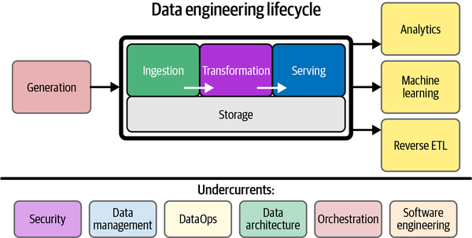

<!-- image ./image -->

### 1. Generation
This is the source. Data engineers usually don't "own" this stage, but they must understand it. This is where data is created by source systems (applications, IoT devices, logs).
* **Concept:** Data is generated in various formats (JSON, CSV, Avro) and types (relational, non-relational). The quality of data here dictates the quality downstream ("Garbage In, Garbage Out").

| **Category** | **Open Source** | **GCP Service** |
| :--- | :--- | :--- |
| **Databases (OLTP)** | PostgreSQL, MySQL, MongoDB | **Cloud SQL**, **Cloud Spanner**, **Firestore** |
| **Logs/Events** | Fluentd, Logstash | **Cloud Logging** |

### 2. Storage
Notice how "Storage" sits *underneath* the processing stages (Ingestion, Transformation, Serving). This indicates that data is persisted at various points—raw data lands in a lake, processed data sits in a warehouse, etc.
* **Concept:** You need scalable, durable, and cost-effective storage. Modern architectures often separate compute (processing) from storage.

| **Category** | **Open Source** | **GCP Service** |
| :--- | :--- | :--- |
| **Object Storage** (Files/Blob) | MinIO, Ceph, HDFS | **Google Cloud Storage (GCS)** |
| **Data Warehouse** (Analytical) | ClickHouse, Apache Druid | **BigQuery** (Storage component) |

### 3. Ingestion
This is the act of moving data from the **Generation** sources into your **Storage**.
* **Concept:**
    * **Batch Ingestion:** Moving data in chunks at a set interval (e.g., once a day).
    * **Streaming Ingestion:** Moving data continuously in real-time as it is generated.

| **Category** | **Open Source** | **GCP Service** |
| :--- | :--- | :--- |
| **Batch / ELT** | Airbyte, Meltano | **BigQuery Data Transfer Service** |
| **Streaming / Events** | Apache Kafka, Apache Pulsar | **Pub/Sub** |

### 4. Transformation
This is often the most complex stage. Raw data is rarely ready for analysis; it needs to be cleaned, joined, and modeled.
* **Concept:**
    * **Data Modeling:** Structuring data (e.g., Star Schema) so it is easy to query.
    * **Business Logic:** Calculating metrics like "Monthly Recurring Revenue."

| **Category** | **Open Source** | **GCP Service** |
| :--- | :--- | :--- |
| **SQL-based** | **dbt** (works with any warehouse) | **BigQuery** (Native SQL processing) |
| **Code-based (Big Data)** | Apache Spark, Apache Flink | **Dataflow** (Apache Beam), **Dataproc** (Managed Spark) |

### 5. Serving
This is the "Last Mile." Data has no value unless it is delivered to a user or system that can use it.
* **Analytics:** Powering Dashboards and BI tools.
* **Machine Learning:** Feeding "Feature Stores" for training or inference.
* **Reverse ETL:** Moving processed data *back* into operational systems (e.g., pushing a "High Value Customer" flag from the warehouse back into Salesforce).

| **Category** | **Open Source** | **GCP Service** |
| :--- | :--- | :--- |
| **BI / Analytics** | Apache Superset, Metabase | **Looker**, Looker Studio |
| **Machine Learning** | MLflow, Kubeflow | **Vertex AI** |
| **Reverse ETL** | RudderStack (OSS Edition) | (Usually handled by partner tools or custom Cloud Functions) |

---

### The Undercurrents
These are the colored boxes at the bottom. They are not "steps" but continuous responsibilities that apply across the *entire* lifecycle.

1.  **Security:** Managing access (IAM), encryption, and PII (Personally Identifiable Information) protection.
    * *GCP Tool:* **Cloud IAM**, **Secret Manager**.
2.  **Data Management:** Data governance, catalogs, and lineage (knowing where data came from).
    * *GCP Tool:* **Data Plex**, **Data Catalog**.
3.  **DataOps:** Automation, CI/CD, and observability.
    * *GCP Tool:* **Cloud Build**, **Cloud Monitoring**.
4.  **Orchestration:** The "conductor" of the orchestra. It triggers the Ingestion, then the Transformation, then the Serving in the correct order.
    * *OSS Tool:* **Apache Airflow**, Dagster, Prefect.
    * *GCP Tool:* **Cloud Composer** (Managed Airflow), **Google Cloud Workflows**.

---

### Let's put this into practice

The most common "modern data stack" pattern on GCP right now usually looks like this:
1.  **Ingest** via **Pub/Sub** or **BigQuery Data Transfer**.
2.  **Store** in **BigQuery**.
3.  **Transform** inside BigQuery using **dbt** or SQL.
4.  **Orchestrate** it all with **Cloud Composer (Airflow)**.
