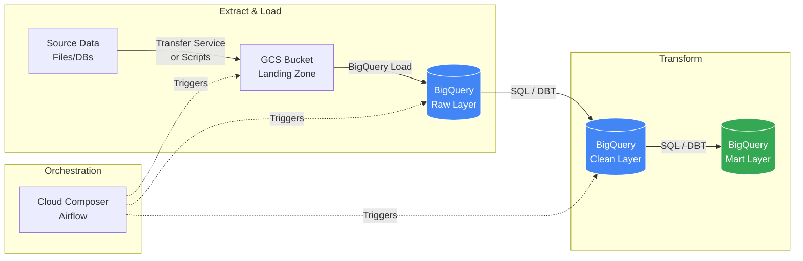
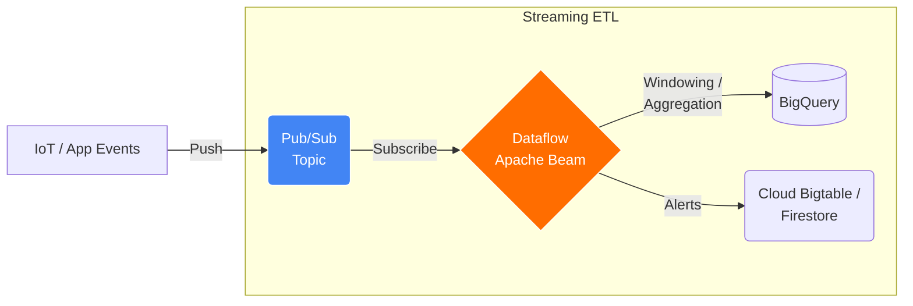
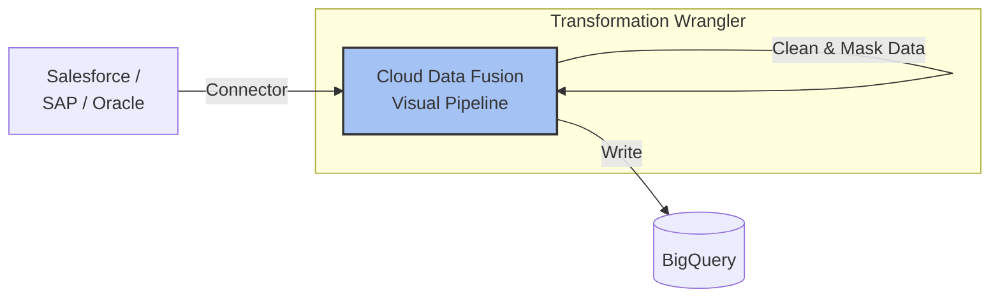

In GCP, the modern trend heavily favors **ELT** (loading data into BigQuery first, then transforming it) because of BigQuery's massive scalability. However, **ETL** is still critical for streaming low-latency data or complex processing that SQL cannot handle easily.

-----

### **1. Core Processing Services (The "Engines")**

These are the main tools that actually "touch" and modify your data.

#### **A. Google Cloud Dataflow**

  * **What it is:** A fully managed, serverless service for running Apache Beam pipelines.
  * **How it is used:** You write code (Java, Python, or Go) defining "PCollections" (data) and "PTransforms" (logic). You submit this code to Dataflow, which automatically provisions workers to process it.
  * **Why use it:**
      * **Unified Stream & Batch:** It uses the exact same code for streaming data (real-time) and batch data (historical).
      * **Serverless:** No clusters to manage. It autoscales worker nodes up and down based on traffic.
      * **Complex Logic:** Best for complex windowing (e.g., "count events every 5 minutes"), sessionization, or heavy custom logic not possible in SQL.

#### **B. Google Cloud Dataproc**

  * **What it is:** Managed Apache Hadoop and Spark service.
  * **How it is used:** You spin up a cluster (Master + Worker nodes), submit your Spark/Hadoop jobs, and then (optionally) delete the cluster to save money ("ephemeral clusters").
  * **Why use it:**
      * **Lift and Shift:** If you already have on-premise Hadoop/Spark jobs, you can move them here without rewriting code.
      * **Open Source Ecosystem:** You want access to the vast ecosystem of Spark tools and libraries.
      * **Cost Control:** You can use "Preemptible VMs" (spot instances) for worker nodes to save \~80% on costs.

#### **C. Cloud Data Fusion**

  * **What it is:** A fully managed, cloud-native **GUI (Visual)** data integration service (based on open-source CDAP).
  * **How it is used:** You do not write code. You drag and drop "source" and "sink" boxes on a canvas and connect them with "transform" boxes (Wrangler).
  * **Why use it:**
      * **No-Code:** Ideal for data analysts or teams without heavy coding skills.
      * **Pre-built Connectors:** Has 150+ plugins ready to go (Salesforce, Oracle, SAP, etc.).
      * **Visual Lineage:** You can visually see how data changes from point A to point B.

-----

### **2. Storage & Warehousing (The "Destination/Source")**

#### **D. BigQuery**

  * **What it is:** Serverless, highly scalable Data Warehouse.
  * **How it is used (ELT):** Data is loaded *raw* into BigQuery staging tables. Then, you use SQL (`CREATE OR REPLACE TABLE AS SELECT...`) to clean and transform it inside BigQuery.
  * **Why use it:**
      * **Speed:** Can process petabytes in minutes.
      * **Simplicity:** Everyone knows SQL; you don't need Java/Python experts for transformations.
      * **Separation of Compute & Storage:** You pay for storage cheaply, and pay for query processing separately.

-----

### **3. Ingestion & Streaming (Getting Data In)**

#### **E. Cloud Pub/Sub**

  * **What it is:** Asynchronous messaging service (Ingestion buffer).
  * **How it is used:** Your applications publish "messages" (events) to a Topic. Dataflow subscribes to that Topic to process data in real-time.
  * **Why use it:** Decouples your intake. If your Dataflow pipeline crashes, Pub/Sub holds the messages safely until the pipeline is back up (reliability).

#### **F. Datastream**

  * **What it is:** Serverless **CDC (Change Data Capture)** and replication service.
  * **How it is used:** It watches your operational database (MySQL, PostgreSQL, Oracle) transaction logs. When a row changes, it immediately replicates that change to BigQuery or Cloud Storage.
  * **Why use it:** To keep your Data Warehouse in sync with your Production Database in near real-time without writing complex scripts.

-----

### **4. Orchestration (The "Conductor")**

#### **G. Cloud Composer**

  * **What it is:** Managed **Apache Airflow**.
  * **How it is used:** You write Python "DAGs" (Directed Acyclic Graphs) that say: "First run this Dataflow job, wait for it to finish, then run this BigQuery SQL, then send an email."
  * **Why use it:**
      * **Dependency Management:** It ensures task B never starts until task A succeeds.
      * **Scheduling:** It handles the timing (e.g., "Run every day at 3 AM").

-----

### **Architectural Patterns & Graphs**

Here are the standard architectures using the services above.

#### **Scenario 1: Modern ELT (Batch)**

*Best for: Daily reporting, Business Intelligence, cost efficiency.*
Raw data is loaded immediately into BigQuery, then transformed using SQL.

#### **Scenario 2: Streaming ETL**

*Best for: Fraud detection, IoT sensors, Real-time dashboards.*
Data must be processed *before* it lands because decisions need to be made instantly.

#### **Scenario 3: Visual ETL (No-Code)**

*Best for: Enterprise integrations, connecting SaaS (Salesforce) to Warehouses.*

### **Summary Comparison Table**

| Service | Best For | Code Requirement | Type |
| :--- | :--- | :--- | :--- |
| **Dataflow** | New pipelines, Streaming, Complex processing | High (Java/Python) | Serverless |
| **Dataproc** | Migrating legacy Spark/Hadoop, ML clusters | High (Spark/Scala) | Managed Cluster |
| **Data Fusion** | Non-coders, Visual integration, Pre-built connectors | None (Drag & Drop) | Managed Service |
| **BigQuery** | ELT, SQL-based transformation, Warehousing | Low (SQL) | Serverless |
| **Datastream** | Syncing Databases (CDC) to BigQuery | Low (Config only) | Serverless |
| **Composer** | Scheduling and Orchestrating the above tools | Medium (Python) | Managed Airflow |
